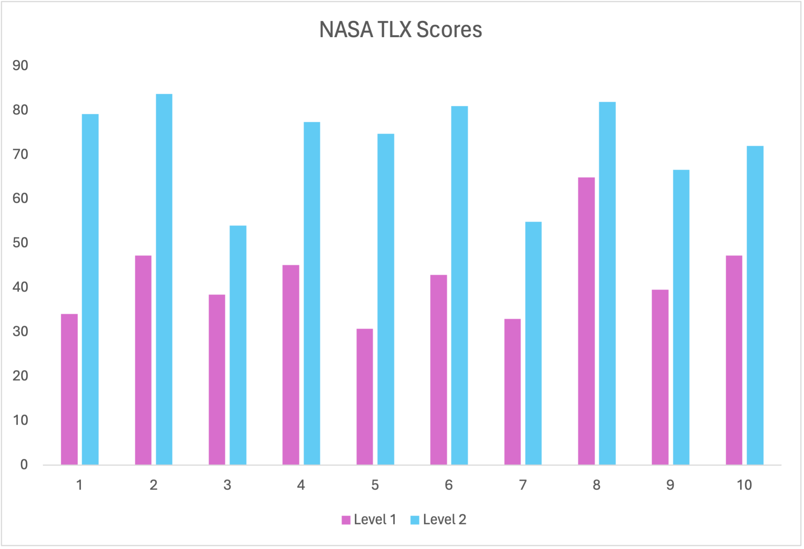

# Group 5

# Contents
[1. Team](#team)

[2. Introduction](#intro)

[3. Requirements](#requirements)

[4. Design](#design)

[5. Implementation](#imp)

[6. Evaluation](#eval)

*# use html tags to make links work (markdown not interpreting normal links properly)*

<h2 id="team">Team</h2>

| Name         | E-mail           | Github  |
| ------------- |:-------------:| :----:|
Hamza Boufous | ij23594@bristol.ac.uk | hamzamboufousm
Ming Liu | yi23835@bristol.uk | VegetableBirdB
Quillan Liu | zp23409@bristol.ac.uk | Quiilan-Liu
Jan Phillips | ls23767@bristol.ac.uk | ZathrasXI
Kisshan Sridhar | bg23463@bristol.ac.uk | kisshan-s

<h2 id="intro">Introduction</h2>

When we first started to think about what kind of game we wanted, we found that we had lots of ideas, and we needed to simplify our choices. The games that we thought would be viable turned out to have many features, a lot of which were not actually necessary. This caused us to turn our focus onto games that were simpler to produce but could be evolved to make a more entertaining product.

After sharing ideas for simpler games as a group, we settled on a game modelled after the popular flash game “copter”, which we believed would be much more viable to produce, as well as being a sort of “blank slate”, upon which that we could incorporate many new features and twists that would make the game much more enjoyable and interesting to play.

<h2 id="requirements">Requirements</h2>

*This section relates to the requirements of our game, where we explore the essential parts needed in our game to provide the best use-case for the users. Through the creation of use-case diagrams and user stories, and the exploration of early-stage design and the ideation process, we finalised the acceptance criteria for a finished project.*

### Use Case Diagram

The figure above shows our use-case diagram. We already had many ideas about what we could add into the game and what we would like to do, but we were unsure which ones to go ahead with. By pausing and thinking about the use cases in relation to the ideas we already had for the game, we were able to obtain a much clearer understanding of what features that we had thought of would be most suitable for the game. Not only did this help us organise our ideas and have a much more focused approach to building our game, but it also helped us to prioritise our workload, as we could see from understanding the use cases which features would be most important to the users. For example, when writing the use case for a player navigating the spaceship around the map to avoid obstacles, we had questions about how to implement certain mechanics of the game. “How are we going to cause the spaceship to fall?”, “How are we going to procedurally generate the map?”. Asking these questions and looking at the game from the perspective of the player brought the most pressing matters into focus and allowed us to tailor the gameplay experience specifically for the player.

From desigining a use-case diagram, we were able to distinguish between two types of player, a regular player and an experienced player. Fortunately, the simple nature of our game means that there is little difference in the two players, bar the experienced player being able to see their previous high score from the high score menu. With this in mind, we were able to go forward with the design process and similarly ensure the game catered to any type of player. For example, we originally had a tutorial level which would play every time the game was run. While this was great for new players as it would teach them the controls in a consequence-free setting, for experienced players it would be very tiring and possibly deter them from starting a new game if they had to go through the tutorial each time. Based on that, we implemented a simple panel which explained the controls that would show at the start of each game. The player could simply click to begin the game from then on. This was a non-intrusive way to showcase the controls and could be shown to both player types.

### User Stories
The creation of user stories in tandem with use-cases further bolstered our understanding of what features our game required, and in turn, which of our ideas were unnecessary for the final implementation. The user stories are as follows:

##### As a Player:
> I want to be able to open the game just by clicking on it.

> I want to be able to start the game by clicking Start Game.

> I want to be able to save my score.

> I want to move the spaceship using mouse left click.

> I want to be able to unlock new maps.

> I want to be able to view the controls.

> I want to be able to adjust volume.

> I want to be able to set the difficulty before I start the game.

> I want to be able to enter my name, see my score, and save my details when the game ends.

##### As an Experienced Player:

> I want to be able to view my previous high scores.

> I want to receive a ‘congratulations’ message for setting a new high score.

> I want to be able to unlock new enemies.

> I want to be able to unlock new weapons.

By delineating user actions, we gained insight into how our game mechanics should function in practice, enabling us to make more informed decisions on which of our ideas we should pursue and develop further. For example, it became clear that we should focus our efforts on core gameplay mechanics first, such as responsive controls. This allowed us to work efficiently and avoid wasting time on features that weren’t necessary. 

We were also able to gain a better understanding of the scope of the project. Again, helping us to avoid wasting time on ideas that weren’t feasible, the fact that we weren’t overcommitting to any one feature meant that we had streamlined ideas, and a project that could be completed within the time we had.

Overall, looking at the game through the lens of different types of users allowed us to uncover new features that were required, as well as ascertain which of our ideas would provide the most improvement to the experience of a certain user without hindering the experiences of other users, and therefore, has been crucial in the development of our game.

<h2 id="design">Design</h2>

*This section explores the design aspects of our game. Thinking about system architecture, creating class and behaviour diagrams, and drawing on the previous information we learned from thinking about requirements, provided a roadmap for development. This ensured we can stay on track with our goals and ensure that the final product is able to meet the intended requirements.*

### System Architecture
Reflecting on our game system’s core design, it was clear that the utilisation of an Object-Oriented Architecture (OOA) was incredibly useful in shaping the collaborative development process. The inherent benefit of OOA is in its ability to provide clear and structured organisation of classes, which assuaged the time wasted in team discussions on clarification of systems (Herbsleb, 2011). On top of helping to streamline collaboration, OOA also allowed team members to focus on their own tasks without affecting the work of others. 

Furthermore, its synergy with the agile development style is of great benefit, as it allowed members to make incremental enhancements to the code. The modular nature of OOA allows for the iterative and adaptive style of development embodied by the agile process (Beck, 2001), which allowed us to address challenges as and when they appeared.

### Class Diagram

The figure above illustrates the high-level class diagram for the game system. The main classes are `FixedObject`, `MoveObject`, and `Map`. Each encapsulating specific functionalities and attributes. Relationships between classes, such as associations and dependencies, are depicted to illustrate the interactions between objects.

#### Major Classes

+ *Spaceship*: represents the players spaceship, which will be equipped with health points and weapons. It has a central role in gameplay, as evidenced by the 1..1 relationship with the Player. It is also part of a composition relationship with an array of weapon objects.
+ *Enemy*: Abstracts various enemy types in the game, which can be extended into specialist enemy types.
+ *Map*, *Panel*, and *Obstacle*: Concerned with the game’s environment, UI, and difficulty, respectively.
  - `Map` creates moveable map objects.
  - `Panel` displays scores and statistics.
  - `Obstacle` checks for player collisions.
+ *MoveObject* and *FixedObject* - these are two main base classes for all objects within the game, and allows for the
  distinction to be made between moveable and static entities.\

Importantly, the creation of the class diagram itself provided clarity on the architecture. Creating the diagram involved thinking about multiplicity in class relationships, as well as inheritance and polymorphism, which allowed us to streamline our ideas. In addition to this, the diagram served as an effective communication tool amongst our team, and facilitated a shared understanding of the game’s overall design and structure, so everyone knew how the system worked.

Using the class diagram provided a clear and organised visual representation of the game’s architecture, making very complex relationships between classes more understandable. This proved invaluable when it came to development. Most notably, the diagram acted as a blueprint for the development process, guiding how we implemented our classes, their methods, and cross-class interactions.

The structure lended itself easily to modification, by identifying the core classes like `MovedObject` and `FixedObject` early, we were able to build upon and extend those classes into more specialised ones with specific responsibilities. The addition and removal of elements such as  weapons became easy to do without significant overhaul of the system due to the way each class was designed.

An example of the flexibility of the architecture lies in the `Enemy` system. When we first played the game, we found there was a lot of screen clutter because of the number of different enemies. The use of an `Enemy` subclass, where special enemy types can inherit from, allowed us to remove unnecessary classes without affecting the other enemy types.

A big challenge design was to balance the need for a comprehensive design (capturing all the necessary details of the game’s classes) with simplicity. Desigining our classes in a way where we specifiy a broad subclass (like `MoveObject`), and extend it further from there, we were able to create something that was interpretable by all members.

<h2 id="imp">Implementation</h2>

<h2 id="eval">Evaluation</h2>

*This is the evaluations section, where we go through quantitative and qualitative evaluations, which we have used to make our game better. Here, we also describe the different methods of testing we employed in our code to ensure it was in working order.*

### Quantitative Evaluation: NASA TLX Scores

For our quantitiativ evaluation, we used the NASA Task Load Index, which has been verified to provide valuable insights into users' subjective experiences and perceived workload when interacting with the system [^3]. In the interest of obtaining reliable data, we selected 10 users to fill out a [provided TLX form](docs/TLXScale.pdf) [^4]. We decided to use the **raw scores** rather than the weighted scores as it has similar correlation, but is easier to analyse and more time-efficient [^5]. The TLX data can be found [here](docs/NASA_TLX.md).  The first level is our game's default easy mode (aimed at beginners) and the second level is our harder level for more experienced players: 

Once we obtained the data, we performed a Wilcoxon signed-rank test using [this calculator](https://www.statology.org/wilcoxon-signed-rank-test-calculator/) and obtained a W-value of 0, indicating users found that the second level had a significant increase in percieved workload compared to the first. 

 

### Qualitative Evaluation: Heuristic Evaluation

For our qualitative evaluation, we utilised the Nielsen Group's heuristic evaluation guide[^6]. We first asked people to familiarise themselves with Jakob Nielsen's 10 usability heuristics for software projects [^1] and once they felt confident in their understanding, we asked them to play our game and examine it based on the heuristics in [this workbook](docs/Heuristic_Evaluation_Workbook_1_Fillable.pdf) [^2]. Collecting and collating [the responses](docs/heuristicEvaluation.md) allowed us to obtain three valuable pieces of information per heuristic:
- What works well
- What issues prevented us from achieving the heuristic
- Recommendations for improving our software to attain the heuristic

Based on this information, we set about incorporating the following changes:

### Addressing Feedback

*Things we could do to address the criticisms raised in the user feedback*

#### Adding a tutorial panel
This would resolve the following issues with users:
- Dying immediately when the game begins.
- Not knowing why they are dying.
- Not understanding the aim of the game.
- Not knowing what each element in the game is.
- Not knowing how to play.
- Not knowing that you have missiles and lasers.
- Knowing which obstacles are good/bad.

#### Increased testing to fix bugs
- The continue button (at the end of a game) takes too long to respond
- Sliders are difficult to use
- The image for the cursor is slightly too big, which means that sometimes the user thinks they are clicking on something, but they aren't.
- Shooting as many missiles as possible can cause the computer to crash.
- Pressing 'z', perhaps other keys too, during the loading screen to crash because a NullPointerException is raised and not caught
- It's not possible to turn of the shield

#### Changing Features to Enhance Gameplay
- Weapons have limited ammo (currently there is no limit)
- One weapon can destroy an alien, and the other can destroy an asteroid (must be made clear in tutorial panel which does what)
- The shield must have limited time use
- Shooting an asteroid could reveal minerals/gems/aliens
- Can use the keyboard instead of the mouse to move the spaceship

#### UI improvements
- Change the background on the main menu, the text, labels and animations are misleading
- A cleaner look for the settings menu, a couple of people said that is ugly
- The spaceship has a thruster on it's underside, which fires everytime it moves upwards/replace the spaceship with an astronaut that has a booster pack.
- Make the minerals look less like asteroids, more like gems/something attractive

### Code Testing

#### JUnit Testing
 

#### Regression Testing
 

#### Integration Testing
 

[^1]: Nielsen, J. (1994a). Enhancing the explanatory power of usability heuristics. Proc. ACM CHI'94 Conf. (Boston, MA, April 24-28), 152-158.
[^2]: Obtained from Nielsen Norman Group. Available at: https://media.nngroup.com/media/articles/attachments/Heuristic_Evaluation_Workbook_1_Fillable.pdf
[^3]: Hart, S. G. (2006). Nasa-Task Load Index (NASA-TLX); 20 Years Later. Proceedings of the Human Factors and Ergonomics Society Annual Meeting, 50(9), 904-908. https://doi.org/10.1177/154193120605000909
[^4]: Obtained from NASA. Available at: https://humansystems.arc.nasa.gov/groups/tlx/downloads/TLXScale.pdf
[^5]: Grier, R. A. (2015). How High is High? A Meta-Analysis of NASA-TLX Global Workload Scores. Proceedings of the Human Factors and Ergonomics Society Annual Meeting, 59(1), 1727-1731. https://doi.org/10.1177/1541931215591373
[^6]: Moran, K. and Gordon, K. (2024) Heuristic evaluations: How to conduct, Nielsen Norman Group. Available at: https://www.nngroup.com/articles/how-to-conduct-a-heuristic-evaluation/ (Accessed: 20 March 2024). 
