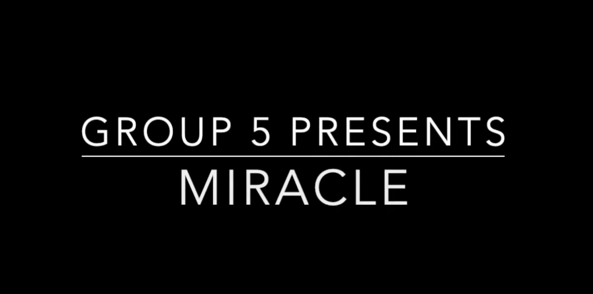
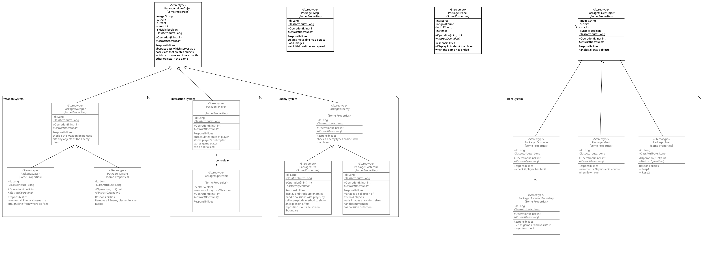

# Group 5 - MIRACLE

    

>Total word count: 4101

# Contents
1. [Team](#team)  
2. [Introduction](#intro)  
3. [Requirements](#requirements)  
    1. [Use Case Diagram](#use-case-diagram)
    2. [User Stories](#user-stories)
4. [Design](#design)  
    1. [System Architecture](#system-architecture)
    2. [Class Diagram](#class-diagram)
5. [Implementation](#imp)  
6. [Evaluation](#eval)  
    1. [Quantitative Evaluation - NASA TLX](#NASA)
    2. [Qualitative Evaluation - Heuristic Evaluation](#HE)
    3. [Addressing Feedback](#addressing-feedback)
    4. [Testing](#testing)
7. [Process](#pro)  
    1. [Team Roles](#roles)
    2. [Tools Used](#tools-used)
        1. [GitHub](#git)
        2. [Pair Programming and Planning Poker](#pair-poker)
8. [Conclusion](#conclusion)

---

<h2 id="team">Team</h2>

| Name         | E-mail           | GitHub  |
| ------------ |:----------------:| :------:|
Ming Liu | yi23835@bristol.uk | VegetableBirdB
Quillan Liu | zp23409@bristol.ac.uk | Quiilan-Liu
Jan Phillips | ls23767@bristol.ac.uk | ZathrasXI
Kisshan Sridhar | bg23463@bristol.ac.uk | kisshan-s

<h4>Team Photo</h4>

  

<h4>Video</h4>

<h2 id="intro">Introduction</h2>

In the initial brainstorming session, our team decided to build a game modelled after the popular flash game [Copter](https://www.crazygames.com/game/copter).

This decision was driven by the fun of the basic Copter gameplay, as well as its simplicity, which would allow us to build upon it with new features like adjustable difficulty, a more exciting setting, and a new story.  Our aim was to transform a classic game into a modern experience that could appeal to both nostalgic players and new audiences. 

We envisioned integrating elements that would encourage strategic thinking and improve replay value, such as dynamic obstacles, being able to use weapons, and shooting enemies. This approach not only promised to rejuvenate a well-loved game but also provided a platform to showcase our technical skills and creativity in game design.

<h2 id="requirements">Requirements</h2>

>663 words

*This section relates to the requirements of our game, where we explore the essential parts needed in our game to provide the best use case for the users. Through the creation of use-case diagrams and user stories, and the exploration of early-stage design and the ideation process, we finalised the acceptance criteria for a finished project.*

<h3 id="use-case-diagram">Use Case Diagram</h3>

The figure above shows our use-case diagram. We already had many ideas about what we could add to the game and what we would like to do, but we were unsure which ones to go ahead with. By pausing and thinking about the use cases in relation to the ideas we already had for the game, we were able to obtain a much clearer understanding of what features we had thought of would be most suitable for the game. Not only did this help us organise our ideas and have a more focused approach to building our game, but it also helped us to prioritise our workload, as we could see from understanding the use cases which features would be most important to the users. For example, when writing the use case for a player navigating the spaceship around the map to avoid obstacles, we had questions about how to implement certain mechanics of the game: “How are we going to cause the spaceship to fall?”; “How are we going to generate the map procedurally?”. Looking at the game from the player's perspective brought the most pressing matters into focus and allowed us to tailor the gameplay experience specifically for the player.

From designing a use-case diagram, we were able to distinguish between two types of players, a regular player and an experienced player. Fortunately, the simple nature of our game means that there is little difference between the two players, bar the experienced player being able to see their previous high score from the high score menu. With this in mind, we were able to go forward with the design process and ensure the game catered to any type of player. 

For example, we originally had a tutorial level which would play every time the game was run. This was great for new players as it would teach them the controls in a consequence-free setting, but for experienced players, it would be boring and possibly deter them from starting a new game if they had to go through the tutorial each time. Based on that, we implemented a simple panel which explained the controls that could be clicked on from the main menu, resulting in a non-intrusive way to display the controls.

<h3 id="user-stories">User Stories</h3>

Creating user stories in tandem with use-cases further bolstered our understanding of what features our game required, and in turn, which of our ideas were unnecessary for the final implementation. The user stories are as follows:

 As a Player: 
  

> I want to be able to open the game just by clicking on it.

> I want to be able to start the game by clicking Start Game.

> I want to be able to save my score.

> I want to move the spaceship using the mouse left click.

> I want to be able to unlock new maps.

> I want to be able to view the controls.

> I want to be able to adjust the volume.

> I want to be able to set the difficulty before I start the game.

> I want to be able to enter my name, see my score, and save my details when the game ends.

 As an Experienced Player: 
  

> I want to be able to view my previous high scores.

> I want to receive a ‘congratulations’ message for setting a new high score.

> I want to be able to unlock new enemies.

> I want to be able to unlock new weapons.

By delineating user actions, we gained insight into how our game mechanics should function in practice, enabling us to make more informed decisions on which of our ideas we should pursue and develop further. For example, it became clear that we should focus our efforts on core gameplay mechanics first, such as responsive controls. This allowed us to work efficiently and avoid wasting time on features that weren’t necessary. 

We were also able to gain a better understanding of the scope of the project. Again, this helped us to avoid wasting time on ideas that weren’t feasible. The fact that we weren’t overcommitting to any one feature meant that we had streamlined ideas, and had a project that could be completed within the time-frame.

Overall, looking at the game through the lens of different types of users allowed us to uncover new features that were required, as well as ascertain which of our ideas would provide the most improvement to the experience of a certain user without hindering the experiences of other users, and therefore, has been crucial in the development of our game.

<h2 id="design">Design</h2>

>669 words

*This section explores the design aspects of our game. Thinking about system architecture, creating class and behaviour diagrams, and drawing on the previous information we learned from thinking about requirements, provided a roadmap for development. This ensured we could stay on track with our goals and ensure the final 
product could meet the intended requirements.*

<h3 id="system-architecture">System Architecture</h3>

Reflecting on our game system’s core design, it was clear that using an Object-Oriented Architecture (OOA) was useful in shaping the collaborative development process. The inherent benefit of OOA is its ability to provide clear and structured organisation of classes, which assuaged the time wasted in team discussions on clarification of systems [^8]. On top of helping to streamline collaboration, OOA also allowed team members to focus on their tasks without affecting the work of others. 

Furthermore, its synergy with the Agile development style is of additional benefit, as it allows for modifiable end goals. The modular nature of OOA facilitates the iterative and adaptive style of development embodied by the agile process [^9], which allowed us to address challenges as and when they appeared.

<h3 id="class-diagram">Class Diagram</h3>

  

The figure above illustrates the high-level class diagram for the game system. The main classes are `FixedObject`, `MoveObject`, and `Map`. Each encapsulates specific functionalities and attributes. Relationships between classes, such as associations and dependencies, are depicted to illustrate the interactions between objects.

#### Major Classes

+ `Spaceship`: represents the player's spaceship, which will be equipped with health points and weapons. It has a central role in gameplay, as evidenced by the 1..1 relationship with the `Player`. It is also part of a composition relationship with an array of weapon objects.
+ `Enemy`: Abstracts various enemy types in the game, which can be extended into specialist enemy types.alt text
+ `Map`, *Panel*, and *Obstacle*: Concerned with the game’s environment, UI, and difficulty, respectively.
  - `Map` creates moveable map objects.
  - `Panel` displays scores and statistics.
  - `Obstacle` checks for player collisions.
+ `MoveObject` and `FixedObject` - the two main base classes for all objects within the game and allow for the distinction between moveable and static entities.

Importantly, the creation of the class diagram itself provided clarity on the architecture. Creating the diagram involved thinking about multiplicity in class relationships, as well as inheritance and polymorphism, which allowed us to streamline our ideas. In addition to this, the diagram served as an effective communication tool amongst our team and facilitated a shared understanding of the game’s overall design and structure [^14], so everyone knew how the system worked.

The class diagram provided a clear and organised visual representation of the game’s architecture, making complex inter-class relationships more understandable. This proved invaluable when it came to development. Most notably, the diagram acted as a blueprint for the development process, guiding how we implemented our classes, their methods, and cross-class interactions.

The structure lent itself easily to modification, by identifying the core classes like `MovedObject` and `FixedObject` early, we established base functionality and extended that into specialised classes with specific responsibilities and designs. The addition and removal of elements such as  weapons became easy to do without a significant overhaul of the system due to how each class was designed.

An example of the architecture's flexibility lies in the `Enemy` system. When we first played the game, we found there was a lot of screen clutter because of the number of different enemies. Using an `Enemy` subclass, from which special enemy types can inherit, allowed us to remove unnecessary classes without affecting the other enemy types.

A big challenge design was to balance the need for a comprehensive design (capturing all the necessary details of the game’s classes) with simplicity. By designing our classes in a way where we specify a broad subclass (like `MoveObject`), and extend it further from there, we were able to create something interpretable by all members.

<h2 id="imp">Implementation</h2>  

>725 words

Our game has many elements that move around the screen. Early on in the development process, we realised that it makes sense to have an object that stores all of the necessary data for moving an element around the game screen. This led to us creating `MoveObject`, which has attributes and methods for accessing coordinates, the value for speed, and the element’s image.

#### Challenge 1: Appropriate level of difficulty

We learned from the Think Aloud user feedback session that our game was:

1. Too hard for first-time players.

2. Became too easy once the player was comfortable with the controls.

We implemented 2 solutions to address this:

1. We created a tutorial for the game. Feedback from new players showed an improvement in understanding of game mechanics.

2. Create a system that gradually increases the difficulty of the game. Every 30 seconds various values are adjusted to make the gameplay more challenging:

- Enemy speed
- The speed of the asteroid belts
- The player safe zone

We found that if we adjusted all of these aspects every 30 seconds then the game became too challenging too quickly, so we used the method `GameLevel1.increaseDifficulty()`, which at random increases 1 attribute and randomly adjusts the gap between the asteroid belts.

#### Challenge 2:

Processing does not have built-in support for when multiple keys are pressed simultaneously. However, we needed this functionality to address user feedback - that it would be better if players could move the spaceship using the keyboard instead of the mouse. 

This seemed like a straightforward feature to implement. We thought we could pass `keyPressed && key == ‘ ‘` into the move() method and this would be the completion of implementing this feature. Though this did move the spaceship, we discovered during testing that the `spaceship` would start falling whenever you pressed another key, e.g. to shoot a missile or use the shield, at the same time as moving the `spaceship`. However, Processing only registers one key press at a time, and the most recent key press has precedence [^16]. 

There are a few complex solutions to this on Stack Overflow and the Processing forum [^15], but in the end, we found a simpler one - using a Hashmap to track the current key presses. Every time a key is pressed, the ASCII code for the key is added to the Hashmap, and when the key is released the ASCII code is removed. This meant that to trigger a method based on a keypress we pass the boolean value of whether the HashMap contains the relevant ASCII code, e.g. to move the spaceship we do move(keysInUse.contains(32)).

#### Challenge 3: The asteroid belts
Reviewing our notes from our first qualitative user feedback session, users said that the game needed clearer boundaries and that it was unclear why the spaceship would lose health when it reached the edges of the screen. Given the context of the game, asteroid belts seemed like ideal boundaries for the screen, however, we faced a few challenges in the implementation:

- The asteroid belt needs to be a continuous, random sequence of asteroids.
- Making the asteroid belts change dynamically.
- Refactoring the code base so that the paths of the enemy UFOs, minerals, and mystery boxes are all within the space between the asteroid belts.

The `AsteroidBelt` object inherits from `MoveObject`, and it procedurally generates the belt of asteroids based on:

- number of asteroids defined, which determines the density of the belt.
- `range` of the belt, which limits the range of the belt against the Y-axis.
- `speed` of asteroids.

Being able to change these values allows us to adjust the difficulty of the game.

Changing the boundaries of the screen like this meant refactoring the code for the other moving elements in the game because they always need to be within the playable space of the screen, i.e., within the gap between the asteroid belts. Prior to this the paths for all moving elements were limited by the constant values of `height` and `width`. Changing the implementation for all of the moving objects so that their paths could be dynamically updated so to keep them between the asteroid belts required restructuring the code base to allow for the necessary values from the `AsteroidBelts` object to be passed to the other moving objects.

<h2 id="eval">Evaluation</h2>

>725 words

*This is the evaluations section, where we go through quantitative and qualitative evaluations, which we have used to improve our game. We also describe the methods of testing we employed.*

<h3 id="NASA">Quantitative Evaluation: NASA TLX Scores</h3>

For our quantitative evaluation, we used the NASA Task Load Index, which has been verified to provide valuable insights into users' subjective experiences and perceived workload when interacting with the system [^3]. In the interest of obtaining reliable data, we selected 10 users to fill out a [provided TLX form](docs/TLXScale.pdf) [^4]. We decided to use the **raw scores** rather than the weighted scores as it has a similar correlation, but are easier to analyse and more time-efficient [^5]. The TLX data can be found [here](docs/NASA_TLX.md).  The first level is our game's default easy mode (aimed at beginners) and the second level is our harder level for more experienced players:

 

   

We performed a Wilcoxon signed-rank test on the data using [this calculator](https://www.statology.org/wilcoxon-signed-rank-test-calculator/), obtaining a W-Value of 0, indicating users found that the second level had a significant increase in perceived workload compared to the first. The dimension where users experienced the most notable workload increase was in the temporal demand, which was fortunate to see, as a large contributing factor to the increase in difficulty between the easier level and the harder one is the fact that the spaceship accelerates faster in the harder level, requiring faster reactions from the player to dodge obstacles.

   

<h3 id="HE">Qualitative Evaluation: Heuristic Evaluation</h3>

For our qualitative evaluation, we utilised the Nielsen Group's heuristic evaluation guide[^6]. We first asked people to familiarise themselves with Jakob Nielsen's 10 usability heuristics for software projects [^1] and once they felt confident in their understanding, we asked them to play our game and examine it based on the heuristics in [this workbook](docs/Heuristic_Evaluation_Workbook_1_Fillable.pdf) [^2]. Collecting and collating [the responses](docs/heuristic evaluation.md) allowed us to obtain three valuable pieces of information per heuristic:
- What works well
- What issues prevented us from achieving the heuristic
- Recommendations for improving our software to attain the heuristic

Based on this information, we set about incorporating the following changes:

<h4 id="addressing-feedback">Addressing Feedback</h4>

*Things we could do to address the criticisms raised in the user feedback*

>#### Adding a tutorial panel
>>This would resolve the following issues with users:
>>- Dying immediately when the game begins.
>>- Not knowing why they are dying.
>>- Not understanding the aim of the game.
>>- Not knowing what each element in the game is.
>>- Not knowing that you have abilities.

>#### Changing Features to Enhance Gameplay
>>- Weapons have limited ammo 
>>- Must be made clear in the tutorial panel what weapons do
>>- The shield must have limited time use
>>- Use the keyboard instead of the mouse to move the spaceship

>#### UI improvements
>>- Change the background on the main menu, the text, labels and animations are misleading
>>- A cleaner look for the settings menu
with an astronaut with a booster pack.
>>- Make the minerals look more distinct

As well as increasing testing and fixing user-reported bugs.

<h3 id = "testing">Testing</h3>

<h4>Regression Testing</h4>

We tested our game frequently during its development lifecycle. Our Git workflow made it easy for us to test each new feature - we had a branch per feature, and before merging the branch into the main branch we would manually test it against a current set of [test cases](docs/test-cases.md), which would grow as the game developed.

This set of test cases provided a good base case for regression testing. As all new features were repeatedly tested against these cases, we could be sure that improvements weren't made at the cost of an earlier one. By utilising black box testing, we could immediately identify improvements or problems in the newer code as one version of the game would be noticeably superior.

Although time-consuming, manual testing allowed us to gain game experience and identify improvement areas. For example, our solution for increasing difficulty was inspired by us having played the game many times.

<h4>Boundary Cases</h4>

As an example of our white-box testing,  we created a table to check asset dimensions to ensure they remained consistent regardless of game state. Collision detection is fundamental to the gameplay experience, so we created a table to map out valid and invalid coordinates, asserting that objects did not detect collisions outside of their set ranges:

##### Intersection Boundary Checks

| Category | Condition |
|----------|:-----------:|
| Coin1  | `coin.curX + 50 >= curX`       |
| Coin2  | `coin.curX + 50 <= curX + 100` |
| UFO1   | `ufo.curX + 50 >= curX`        |
| UFO2   | `ufo.curX + 50 <= curX + 100`  |
| Asteroid Belt (Top) 1    | `curX >= asteroids.topImagePosition`                          |
| Asteroid Belt (Top) 2    | `curX <= asteroids.topImagePosition + asteroids.imgWidth`     |
| Asteroid Belt (Bottom) 1 | `curX >= asteroids.bottomImagePosition`                       |
| Asteroid Belt (Bottom) 2 | `curX <= asteroids.bottomImagePosition + asteroids.imgWidth`  |
| Fast Card 1          | `card.curX + 50 >= curX`                                          |
| Fast Card 2          | `card.curX + 50 <= curX + 100`                                    |

<h2 id="pro">Process</h2>

>829 words

*This is the process section, where we discuss how we organised ourselves and coordinated with the team to produce the best result we can*

Our goal for our process was to work according to the Agile methodology. We held weekly meetings on Mondays after each workshop, which provided a valuable opportunity for face-to-face discussions and to build up rapport within the team. Additionally, we frequently held 'Chorei' style meetings [^7], where each member informed the team of their current task and expected completion time. These sessions were held over the phone, to allow ease of participation. Due to their brevity and regularity, missing one meeting was not detrimental, as another meeting would soon follow. Being aware of other members' activities assisted collaboration, often resulting in overlapping efforts and smoother project execution.

<h3 id="roles">Team Roles</h3>

| Team Member     | Role                      | Contribution | 
| ------------    | :-----------------------: | :----------: |
| Ming Liu        | Lead developer            |       1      |
| Quillan Liu     | Lead UX designer          |       1      |
| Jan Phillips    | PM and developer          |       1      |
| Kisshan Sridhar | PM and documentation lead |       1      |

<h3 id="tools-used">Tools Used</h3>

To assist us in collaboration, we employed a number of tools to ensure all members were on the same page:
- Github
- Kanban Board
- Pair Programming
- Planning Poker

<h4 id="git">GitHub</h4>

GitHub played a central role in team organisation. GitHub offered many tools to help us follow the Agile methodology, starting with the Kanban board.

##### Kanban Board

The Kanban board was fundamental to monitoring our progress as a team. As studies have shown, Kanban's main benefits lie in work visibility, monitoring workflow, and control of project activities and tasks [^10] :  

  
*Snapshot of Kanban board*

Using Kanban on GitHub provided synergy with its other features; we were able to assign Kanban issues to members and create branches for those issues to be solved:    

  

   

##### Branches and Pull Requests  

*Snapshot of our Git log.*

  

Once an issue was finished, it was moved from `in progress` to `in review` on the Kanban board and a pull request was made for the branch to be merged into `main`. This signified that the issue was closed, and the corresponding item was moved from to `done` on the Kanban.  

   

Overall, utilising the Kanban board allowed us to establish a clear, visual representation of our project status. However, the Kanban board did not allow us to grade the difficulty of each task to implement. Therefore, we decided to use the Agile practices of pair programming and planning poker to bridge the gap.

<h4 id="pair-poker">Pair Programming & Planning Poker</h4>  

##### Planning Poker  

Once we populated the Kanban with issues to be solved, we held 'planning poker' sessions at weekly meetings, as it has proven to be helpful in cementing team understanding and estimating effort for items to be implemented [^11]. We found planning poker sessions to be informative to our understanding of the difficulty of a task, as well as being able to solve any misunderstandings between members.

One such example was when we decided on the difficulty of adding a story to the game. Half the team thought this would be very easy, as it involved writing a short backstory which required very little effort, whereas the other half considered this to be much more effortful, as it would require a new button on the main menu that players could click on to view the story, which would require a redesign of the main UI. If we were using just a Kanban board, this misunderstanding would have caused issues in team flow, but through planning poker, we were able to plan with awareness of how each subteam viewed the difficulty of a task and allocated the proper time for it.  

##### Pair Programming

Ming held the most expertise with Processing, which meant he also had to field questions from other members when they had problems. However, this quickly became unstable. Issues frequently required Ming's assistance and Ming was suffering burnout because of the extra workload and this had to change - so we decided to work in pairs.

Pair programming benefitted our team greatly by facilitating knowledge sharing. Ming held the most experience and was the "tower of knowledge" [^12] that our team learned from. As Ming [shared his knowledge](docs/projects-to-learn-processing) with others, the whole team felt more comfortable using Processing. Soon we found that we were able to complete tasks faster and share the workload much more equally.

Pair programming is documented to lead to a decrease in mental workload as well as an increase in code quality[^13]. At this time there were numerous other responsibilities that we had to perform outside of the engineering module, namely exams and assignments for other modules. The reduction in our workload improved our moods, which fostered a positive mindset that made us more focused.

We have found first-hand how beneficial employing Agile methods like pair programming, planning poker, and Kanban can be for a team working on a complex design project. Creating issues and classifying them based on difficulty gave us a timeframe to work to and ensured that no one member was bearing a heavier workload than another. Combined with the workflow control function of Git, we were able to work smoothly as a team and integrate everyone's work into the final product. Going forward, we know that we have picked up skills that will certainly be of benefit in the future.

<h2 id="conclusion">Conclusion</h2> 

>357 words

Reflecting on this project as a team, we all felt that we learned a lot from it - particularly in working as part of a software **team** - not just as individuals as we had been so far.

Thinking about the process especially, we quickly learned that if the whole team isn't on the same page and working at the same level, everyone suffers for it. It was vital to us to ensure that we performed the Agile methods of planning poker, open communication, pair programming, and Kanban to ensure everyone had a strong foundation to build on. 

A large challenge when designing a game is how rapidly it changes - features that may seem promising at first turn out to be too difficult to implement and others may be received poorly by the users. Reflecting on design, we see that an OOA was vital to our project, as it was perfectly suited for the iterative and adaptive development that building a game required. 

Of course, such changes could not be implemented without a strong evaluative process, which we managed well, using both qualitative and quantitative data. Cross-referencing the two enabled us to spot where issues in our code came from and begin work on tackling them, resulting in a game that was field-tested to be fun and engaging and underscoring the importance of routine user feedback in development.

Had we the time and resources to develop the game further, the next immediate features we would want to add are: 

- LAN multiplayer - an idea we had at the start but discarded as it would take too long
- A game map where players can explore different planets and systems to hunt rarer materials
- Enhanced enemy AI 

All to make the game more exciting and enhance replayability.

In sum, this project was as much about learning effective team collaboration and agile project management as it was about game development. Tools like GitHub and Kanban boards proved essential in maintaining a dynamic and responsive development environment. These experiences have equipped us with valuable skills and insights, preparing us for future projects with an enhanced approach to tackling software development challenges.

-------
<h2>Bibliography</h2>

[^1]: Nielsen, J. (1994a). Enhancing the explanatory power of usability heuristics. Proc. ACM CHI'94 Conf. (Boston, MA, April 24-28), 152-158.
[^2]: Obtained from Nielsen Norman Group. Available at: https://media.nngroup.com/media/articles/attachments/Heuristic_Evaluation_Workbook_1_Fillable.pdf
[^3]: Hart, S. G. (2006). Nasa-Task Load Index (NASA-TLX); 20 Years Later. Proceedings of the Human Factors and Ergonomics Society Annual Meeting, 50(9), 904-908. https://doi.org/10.1177/154193120605000909
[^4]: Obtained from NASA. Available at: https://humansystems.arc.nasa.gov/groups/tlx/downloads/TLXScale.pdf
[^5]: Grier, R. A. (2015). How High is High? A Meta-Analysis of NASA-TLX Global Workload Scores. Proceedings of the Human Factors and Ergonomics Society Annual Meeting, 59(1), 1727-1731. https://doi.org/10.1177/1541931215591373
[^6]: Moran, K. and Gordon, K. (2024) Heuristic evaluations: How to conduct, Nielsen Norman Group. Available at: https://www.nngroup.com/articles/how-to-conduct-a-heuristic-evaluation/
[^7]: Sarandeska, I. (2019) Chorei: A Japanese morning business routine for a Productive Day, Kanban Zone - The Lean Software to do More with Less. Available at: https://kanbanzone.com/2019/chorei-japanese-routine-for-productivity/
[^8]: Herbsleb, James D. and Audris Mockus. “An Empirical Study of Speed and Communication in Globally Distributed Software Development.” IEEE Trans. Software Eng. 29 (2003): 481-494.
[^9]: Beck, Kent L. et al. “Manifesto for Agile Software Development.” (2013).
[^10]: dos Santos, P.S.M., Beltrão, A.C., de Souza, B.P. et al. On the benefits and challenges of using kanban in software engineering: a structured synthesis study. J Softw Eng Res Dev 6, 13 (2018). https://doi.org/10.1186/s40411-018-0057-1
[^11]: Cohn, M. (2024) Planning poker: An agile estimating and planning technique, Mountain Goat Software. Available at: https://www.mountaingoatsoftware.com/agile/planning-poker
[^12]: Albert, M. (2019) The Pros and cons of pair programming, HackerNoon. Available at: https://hackernoon.com/the-ultimate-guide-to-pair-programming-b606625bc784 
[^13]: Hannay, Jo & Dybå, Tore & Arisholm, Erik & Sjøberg, Dag. (2009). The effectiveness of pair programming: A meta-analysis. Information and Software Technology. 51. 1110-1122. 10.1016/j.infsof.2009.02.001. 
[^14]: Cepeda Porras, G., Guéhéneuc, YG. An empirical study on the efficiency of different design pattern representations in UML class diagrams. Empir Software Eng 15, 493–522 (2010). https://doi.org/10.1007/s10664-009-9125-9
[^15]: Available at: https://discourse.processing.org/t/problem-with-keypressed-and-space/7468
[^16]: Reas, C. and Fry, B. (2023) Key, key. Available at: https://processing.org/reference/key.html. 
